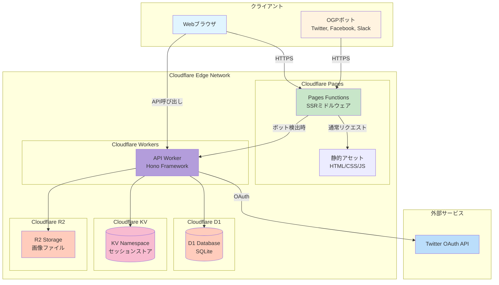
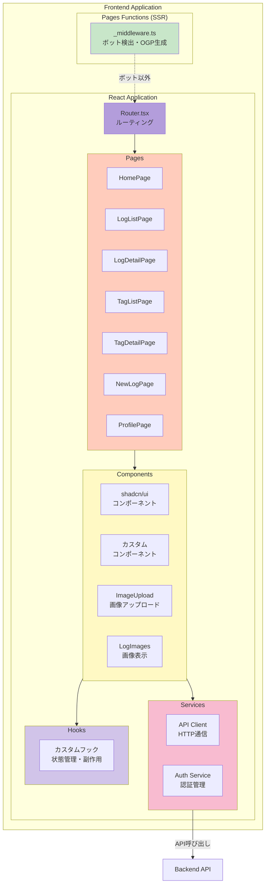
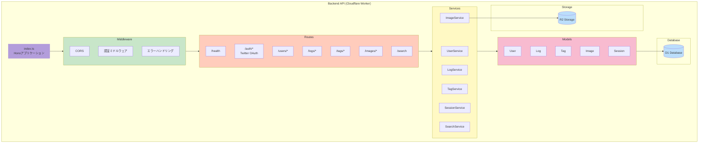
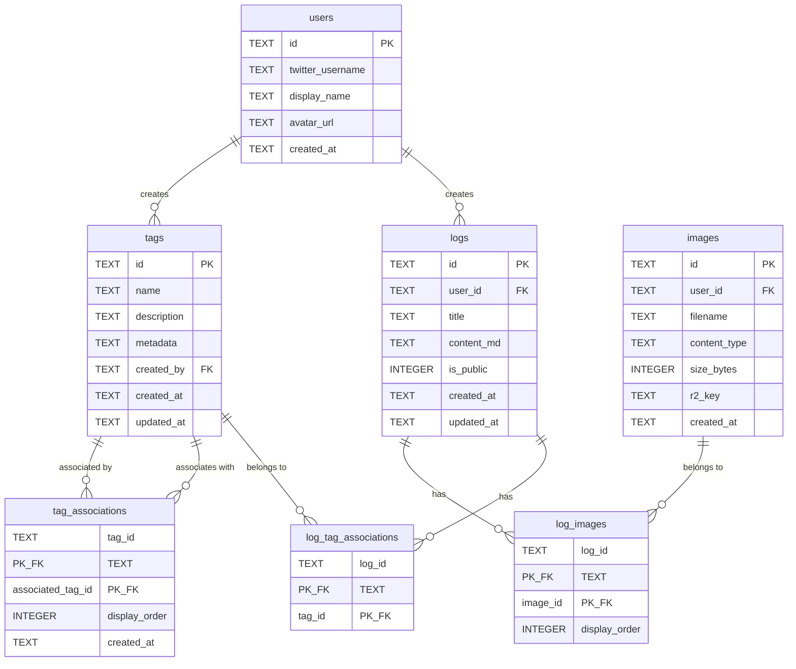
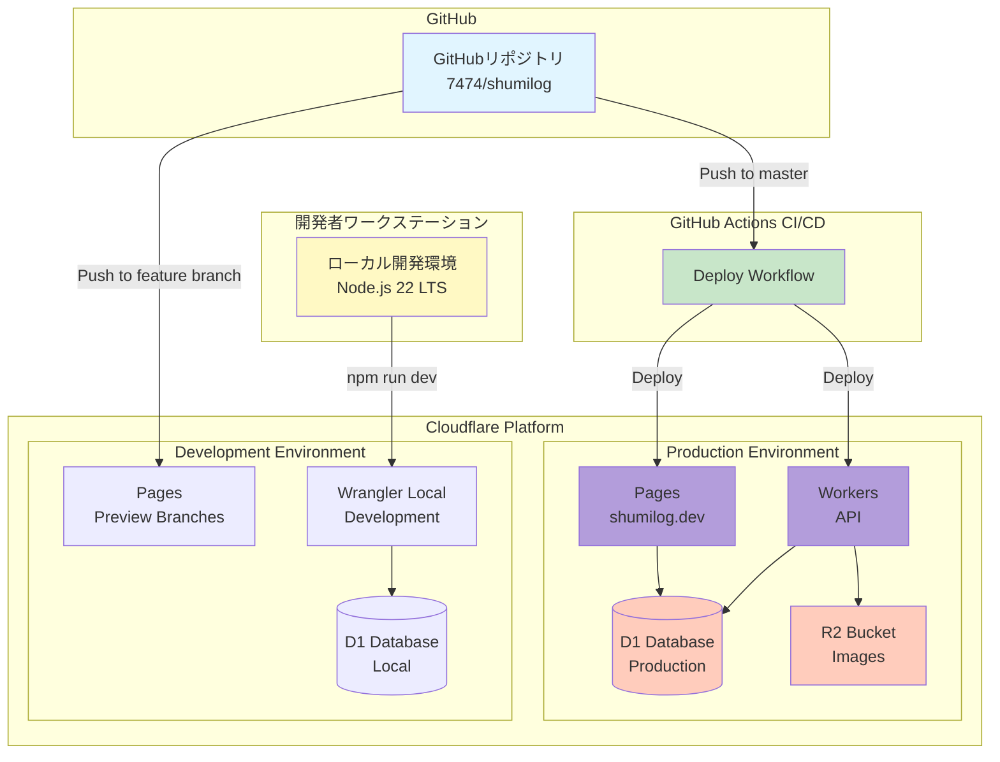
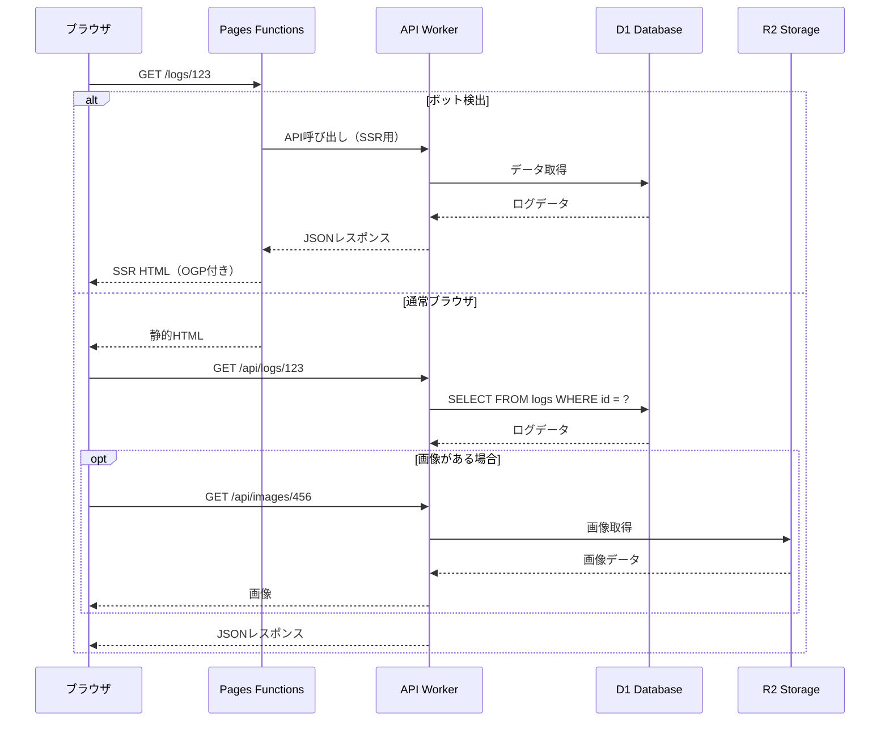
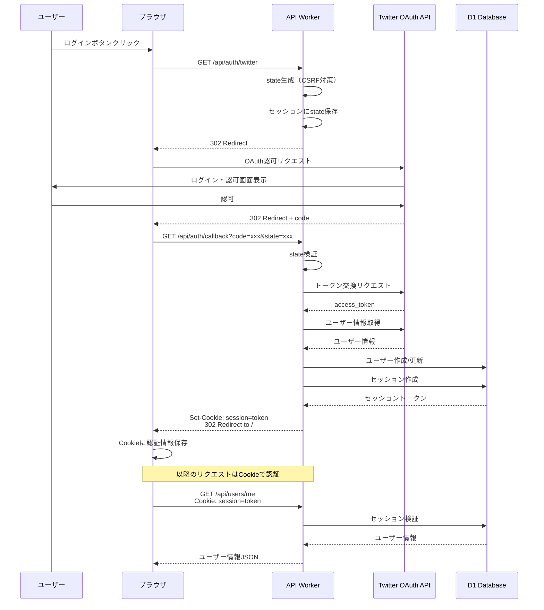
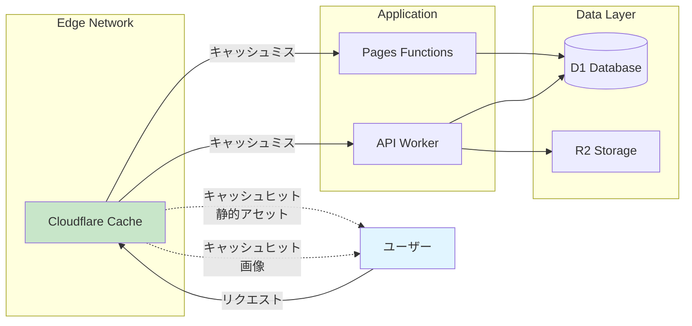

# Shumilog システムアーキテクチャ

本ドキュメントは、Shumilog（趣味コンテンツログサービス）のシステム全体構成を概観するための資料です。

## 目次

1. [システム概要](#システム概要)
2. [システム全体構成](#システム全体構成)
3. [コンポーネント構成](#コンポーネント構成)
4. [データベース設計](#データベース設計)
5. [デプロイメント構成](#デプロイメント構成)
6. [API通信フロー](#api通信フロー)
7. [認証フロー](#認証フロー)

---

## システム概要

Shumilogは、趣味コンテンツのログを記録・共有するためのWebアプリケーションです。Cloudflareのエッジプラットフォーム上で動作し、高速かつスケーラブルなサービスを提供します。

### 主要技術スタック

- **フロントエンド**: React 19 + Vite 7 + Tailwind CSS 4.1 + shadcn/ui
- **バックエンド**: Cloudflare Workers + Hono
- **データベース**: Cloudflare D1 (SQLite)
- **セッションストア**: Cloudflare KV
- **ストレージ**: Cloudflare R2
- **SSR**: Cloudflare Pages Functions
- **言語**: TypeScript 5.9+
- **ランタイム**: Node.js 22 LTS

---

## システム全体構成



### システムの特徴

- **エッジファースト**: すべてのコンポーネントがCloudflareのエッジネットワーク上で動作
- **軽量SSR**: Pages Functionsによる最小限のSSR実装
- **API駆動**: フロントエンドとバックエンドの明確な分離
- **スケーラブル**: サーバーレスアーキテクチャによる自動スケーリング

---

## コンポーネント構成

### フロントエンド構成



### バックエンド構成



---

## データベース設計

### エンティティ関連図 (ERD)



### データモデルの特徴

- **ユーザー管理**: Twitter OAuth認証による最小限のユーザー情報
- **コンテンツ**: Markdown形式のログエントリ（最大10,000文字）
- **タグシステム**: 柔軟なタグ付けと関連付け
- **画像管理**: R2ストレージとの連携によるメタデータ管理

### セッション管理（Cloudflare KV）

セッション情報はCloudflare KVに保存され、D1データベースからは分離されています：

**保存形式:**
- キー: `session:{token}` - セッショントークンからセッション情報を取得
- キー: `user_sessions:{user_id}` - ユーザーIDから複数セッションを管理

**セッションデータ構造:**
```json
{
  "token": "セッショントークン",
  "user_id": "ユーザーID",
  "created_at": "作成日時（ISO 8601）",
  "expires_at": "有効期限（ISO 8601）"
}
```

**特徴:**
- **自動期限切れ**: KVのTTL機能により、期限切れセッションは自動削除
- **高速アクセス**: エッジキャッシュされ、D1よりも低レイテンシ
- **グローバル分散**: Cloudflareのエッジネットワーク全体で利用可能

---

## デプロイメント構成



### デプロイメントフロー

1. **ローカル開発**
   - Wrangler CLI + Viteによる開発サーバー
   - ローカルD1データベースでの開発
   - ホットリロードによる高速イテレーション

2. **継続的デプロイ (CD)**
   - masterブランチへのマージで自動デプロイ
   - GitHub Actionsによるビルド・テスト・デプロイ
   - プレビューデプロイメント（フィーチャーブランチ）

3. **本番環境**
   - Cloudflare Pages: フロントエンド + SSR
   - Cloudflare Workers: APIバックエンド
   - 自動スケーリング・グローバルCDN

---

## API通信フロー

### 標準的なAPI呼び出しフロー



### API エンドポイント一覧

| エンドポイント | メソッド | 説明 | 認証 |
|--------------|---------|------|------|
| `/health` | GET | ヘルスチェック | 不要 |
| `/auth/twitter` | GET | Twitter OAuth開始 | 不要 |
| `/auth/callback` | GET | OAuth コールバック | 不要 |
| `/auth/logout` | POST | ログアウト | 必要 |
| `/users/me` | GET | 現在のユーザー情報 | 必要 |
| `/users/{id}` | GET | ユーザー情報取得 | 不要 |
| `/logs` | GET | ログ一覧取得 | 不要 |
| `/logs` | POST | ログ作成 | 必要 |
| `/logs/{id}` | GET | ログ詳細取得 | 不要 |
| `/logs/{id}` | PUT | ログ更新 | 必要 |
| `/logs/{id}` | DELETE | ログ削除 | 必要 |
| `/tags` | GET | タグ一覧取得 | 不要 |
| `/tags` | POST | タグ作成 | 必要 |
| `/tags/{id}` | GET | タグ詳細取得 | 不要 |
| `/images` | POST | 画像アップロード | 必要 |
| `/images/{id}` | GET | 画像取得 | 不要 |
| `/search` | GET | 全文検索 | 不要 |

---

## 認証フロー

### Twitter OAuth 認証フロー



### セッション管理

- **セッショントークン**: ランダム生成された32文字の文字列
- **保存場所**: HttpOnly Secure Cookie
- **有効期限**: 30日間
- **セキュリティ**: CSRF対策（state パラメータ）、HttpOnly/Secure フラグ

---

## パフォーマンス最適化

### キャッシュ戦略



### パフォーマンス目標

- **90パーセンタイル**: 100ms以下
- **99パーセンタイル**: 500ms以下
- **静的アセット**: エッジキャッシュによる即座の配信
- **画像**: R2 + CDNによる高速配信

---

## セキュリティ

### セキュリティ対策

1. **認証・認可**
   - OAuth 2.0によるセキュアな認証
   - セッショントークンによる状態管理
   - HttpOnly/Secure Cookieの使用

2. **データ保護**
   - HTTPS通信の強制
   - SQLインジェクション対策（パラメータ化クエリ）
   - XSS対策（適切なエスケープ）

3. **アクセス制御**
   - ログの公開/非公開制御
   - ユーザー所有権の検証
   - APIエンドポイントの認証チェック

---

## 開発ワークフロー

### ローカル開発環境

```bash
# 依存関係のインストール
npm install --prefix backend
npm install --prefix frontend

# データベースのセットアップ
cd backend
npm run db:migrate
npm run db:seed

# 開発サーバーの起動
# ターミナル1: バックエンド
cd backend && npm run dev

# ターミナル2: フロントエンド
cd frontend && npm run dev
```

### テスト戦略

1. **コントラクトテスト**: OpenAPI仕様に対するAPI検証
2. **統合テスト**: サービス間の連携テスト
3. **ユニットテスト**: 個別コンポーネント・関数のテスト
4. **スモークテスト**: 基本的な動作確認

---

## まとめ

Shumilogは、Cloudflareのエッジプラットフォームを最大限活用した、モダンでスケーラブルなWebアプリケーションです。

### 主な特徴

- ✅ **フルスタックTypeScript**: フロントエンドからバックエンドまで一貫した開発体験
- ✅ **エッジファースト**: グローバルに高速なレスポンス
- ✅ **軽量SSR**: 必要最小限のサーバーサイドレンダリング
- ✅ **API駆動**: 明確な責務分離とスケーラブルな設計
- ✅ **型安全**: OpenAPI仕様からの自動型生成
- ✅ **開発者体験**: ホットリロード、自動デプロイ、包括的なテスト

### 参考ドキュメント

- [README.md](../README.md) - プロジェクト概要とセットアップ
- [API仕様書](../api/v1/openapi.yaml) - 正規API仕様
- [フロントエンドREADME](../frontend/README.md) - フロントエンド詳細
- [バックエンドREADME](../backend/README.md) - バックエンド詳細
