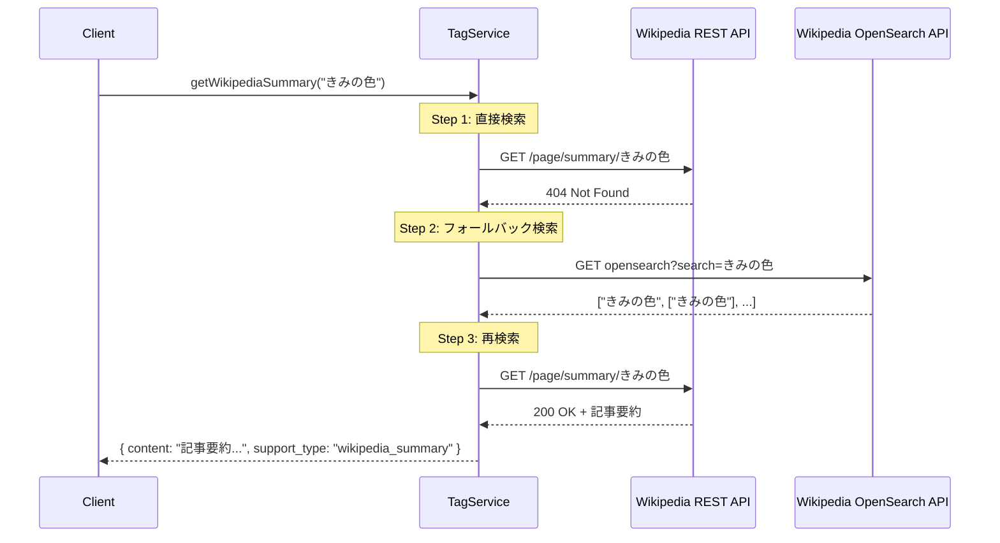

# Wikipedia検索フォールバック - フローチャート

```mermaid
flowchart TD
    Start([タグサポートリクエスト])
    DirectAPI[REST API: /page/summary/{tagName}]
    CheckDirect{直接検索成功?}
    ReturnSuccess([要約を返す])
    OpenSearch[OpenSearch API: 検索実行]
    CheckSearch{記事見つかった?}
    RetryAPI[REST API: /page/summary/{foundTitle}]
    CheckRetry{再検索成功?}
    ReturnError([404エラー])
    
    Start --> DirectAPI
    DirectAPI --> CheckDirect
    CheckDirect -->|200 OK| ReturnSuccess
    CheckDirect -->|404 Not Found| OpenSearch
    OpenSearch --> CheckSearch
    CheckSearch -->|はい| RetryAPI
    CheckSearch -->|いいえ| ReturnError
    RetryAPI --> CheckRetry
    CheckRetry -->|200 OK| ReturnSuccess
    CheckRetry -->|404 Not Found| ReturnError
    
    style Start fill:#e1f5e1
    style ReturnSuccess fill:#e1f5e1
    style ReturnError fill:#ffe1e1
    style OpenSearch fill:#e1e5ff
```

## 具体例: 「きみの色」の検索



## パフォーマンス比較

### 改善前
```
リクエスト → REST API → 404エラー → ユーザーにエラー表示
                         ❌ 記事が存在しても見つからない
```

### 改善後
```
通常ケース（完全一致）:
リクエスト → REST API → 200 OK → ユーザーに要約表示
                         ✅ 1回のAPI呼び出し（変更なし）

フォールバックケース:
リクエスト → REST API → 404 → OpenSearch → 記事発見 → REST API → 200 OK → ユーザーに要約表示
                         ✅ 3回のAPI呼び出し（記事を発見できる）
```

## API呼び出し回数の比較

| ケース | 改善前 | 改善後 | 備考 |
|--------|--------|--------|------|
| 完全一致で記事あり | 1回 | 1回 | 性能への影響なし |
| 部分一致で記事あり | 1回（失敗） | 3回（成功） | 記事を発見できる ✅ |
| 記事なし | 1回（失敗） | 3回（失敗） | 同じ結果だが呼び出し増 |

## まとめ

- ✅ 記事が存在するが完全一致しないタグでも検索可能に
- ✅ 既存の動作（完全一致ケース）への影響なし
- ✅ フォールバック時のみ追加のAPI呼び出し
- ✅ 検索でも見つからない場合は適切にエラー処理
