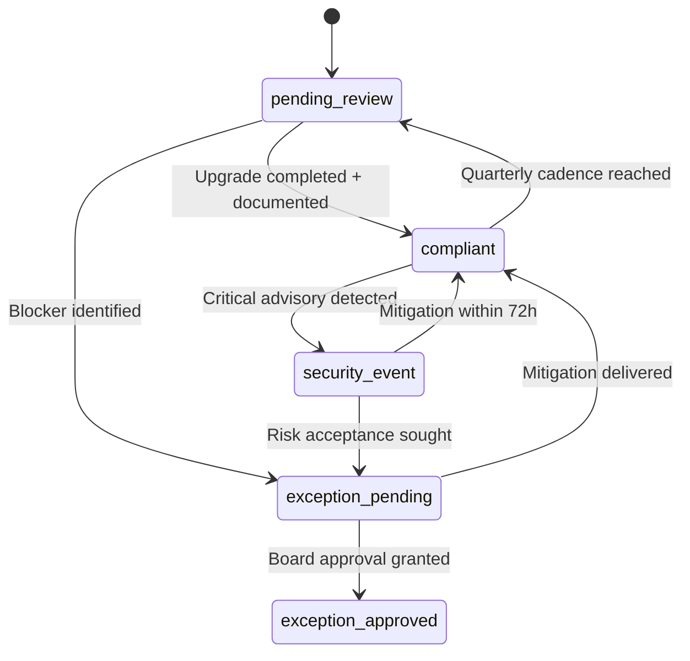

# Data Model — Dependency Maintenance Policy and LTS Alignment

## Entities

### DependencyRecord
| Field | Type | Description |
|-------|------|-------------|
| `id` | string (`workspace:package`) | Deterministic identifier combining workspace and package name. |
| `workspace` | enum (`backend`, `frontend`) | Location of the package. |
| `package` | string | npm package name. |
| `currentVersion` | string (semver) | Version currently installed in lockfile. |
| `targetChannel` | enum (`lts`, `stable`) | Alignment rule per spec (LTS when available, otherwise latest stable). |
| `targetVersion` | string (semver) | Version that satisfies policy at time of review. |
| `lastReviewedAt` | ISO date | Date of most recent quarterly review. |
| `nextReviewDue` | ISO date | Automatically set to `lastReviewedAt + 3 months`. |
| `graceDeadline` | ISO date | `releaseDate + 60 days`; signals escalation when overdue. |
| `owner` | string | Responsible maintainer (engineering lead by default). |
| `exceptionStatus` | enum (`none`, `pending`, `approved`, `expired`) | Tracks cross-functional board decisions. |
| `exceptionNotes` | string | Summary of mitigation plan or reason for exception. |

### MaintenancePolicy
| Field | Type | Description |
|-------|------|-------------|
| `cadence` | enum (`quarterly`) | Formal review interval. |
| `adoptionSLA` | duration (`P60D`) | Grace period before escalation. |
| `securityTriageSLA` | duration (`PT24H`) | Time to triage critical advisories. |
| `securityMitigationSLA` | duration (`P3D`) | Time to mitigate or accept risk. |
| `communicationLeadTime` | duration (`P14D`) | Minimum notice window for stakeholders. |
| `exceptionApprover` | string | Governing body (`Cross-functional review board`). |
| `policyVersion` | string | Semantic version for policy doc (increments per change). |
| `documentation` | link | Path to `docs/dependency-policy.md`. |

## Relationships
- `MaintenancePolicy` is a singleton referenced by all `DependencyRecord` entries.
- Each `DependencyRecord.owner` must map to a known maintainer list (default: engineering lead).*
- Exceptions (`exceptionStatus != none`) require an accompanying entry in an approvals log (to be captured in the policy doc).

## State Transitions

## Validation Rules
- `lastReviewedAt` must be within the last 90 days; otherwise the checker flags stale entries.
- `graceDeadline` must be ≥ `lastReviewedAt`; script raises error when exceeded.
- `targetChannel = lts` requires `targetVersion` to match the latest published LTS line; otherwise, script reports mismatch.
- `exceptionStatus = approved` requires `exceptionNotes` to cite approval date and board summary.

## Derived Data
- `nextReviewDue` drives reminders for upcoming quarterly audits.
- Policy checker derives compliance score (compliant count / total) for reporting in CI output.

*Maintainer list stored in policy doc appendix; initial owner defaults to engineering lead until ownership is redistributed.
